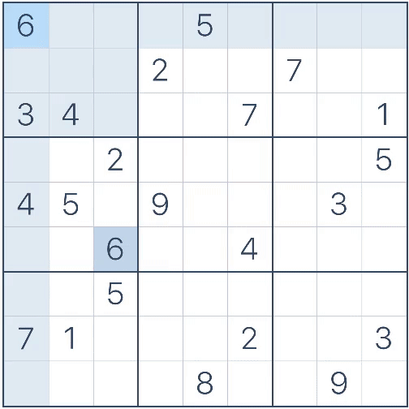

# Sudoku Solver

Sudoku solver with computer vision, OCR and autocomplete for GUI

## Demonstration

Solve and fill Sudoku at [sudoku.com](https://sudoku.com)

+ with a 0.05 second pause between actions (config.pyautogui.PAUSE = 0.05)


+ without pause (config.pyautogui.PAUSE = 0)



## Installation

1) Install Python 3.10 +
2) Clone this GitHub repo
3) Install requirements using `pip install -r requirements.txt`

## Usage

To use this program, run the main.py script in the `src` directory:

`python main.py` or `python3 main.py`

The program will capture a screenshot of your screen after the delay specified in the `config.py` module:

```python
# Delay in seconds before taking a screenshot
SCREENSHOT_DELAY = 1
```

***The Sudoku puzzle must be visible on your screen!*** 
You can run the script and then press `ALT + TAB` into a Sudoku window or use split windows.

Then it will identify the Sudoku location, recognize the digits, solve the puzzle, and fill in the solution on the screen.

***Filling Sudoku requires the site to use keyboard arrows and numbers!*** 
On sites like [onsudoku.com](https://onsudoku.com/play-sudoku/) filling with this program doesn't work!

To avoid filling in the Sudoku puzzle and just see the solution in the terminal, 
comment out or delete this line of code in `main.py`:

```
# sudoku.fill_on_website(solved_sudoku, sudoku_bounds)
```

The [Demonstration](#demonstration) section showed Sudoku fills with different pauses between actions. 
To specify the desired pause in seconds, change the `pyautogui.PAUSE` variable in the `config.py` module.

```
# Delay between moves and filling Sudoku cells. The default in PyAutoGUI 0.1 is too slow
pyautogui.PAUSE = 0.01
```

### Terminal output example

```
*PaddleOCR logs*
Recognized sudoku:
-------------------------
| 8 0 0 | 0 6 0 | 5 0 0 | 
| 0 0 9 | 0 0 0 | 7 0 0 | 
| 1 0 0 | 0 0 2 | 0 6 9 | 
-------------------------
| 0 0 0 | 0 0 0 | 9 0 0 | 
| 0 0 1 | 0 7 0 | 0 8 4 | 
| 2 0 0 | 3 0 0 | 0 0 0 | 
-------------------------
| 0 0 0 | 0 0 0 | 0 5 0 | 
| 0 8 0 | 0 0 7 | 0 0 0 | 
| 0 0 4 | 0 8 0 | 0 1 6 | 
-------------------------

Solved sudoku:
-------------------------
| 8 2 3 | 7 6 9 | 5 4 1 | 
| 6 5 9 | 4 3 1 | 7 2 8 | 
| 1 4 7 | 8 5 2 | 3 6 9 | 
-------------------------
| 4 7 5 | 6 1 8 | 9 3 2 | 
| 9 3 1 | 2 7 5 | 6 8 4 | 
| 2 6 8 | 3 9 4 | 1 7 5 | 
-------------------------
| 3 1 2 | 9 4 6 | 8 5 7 | 
| 5 8 6 | 1 2 7 | 4 9 3 | 
| 7 9 4 | 5 8 3 | 2 1 6 | 
-------------------------
Time taken: 11.52 seconds
```

# License

This project is licensed under the [MIT License](LICENSE).

---

[YouTube video](https://youtu.be/8n7qjMnM_FQ)
